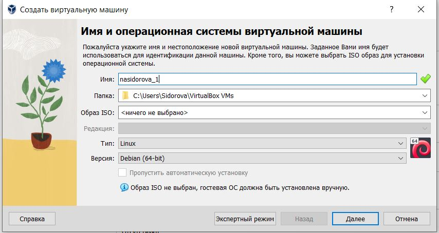
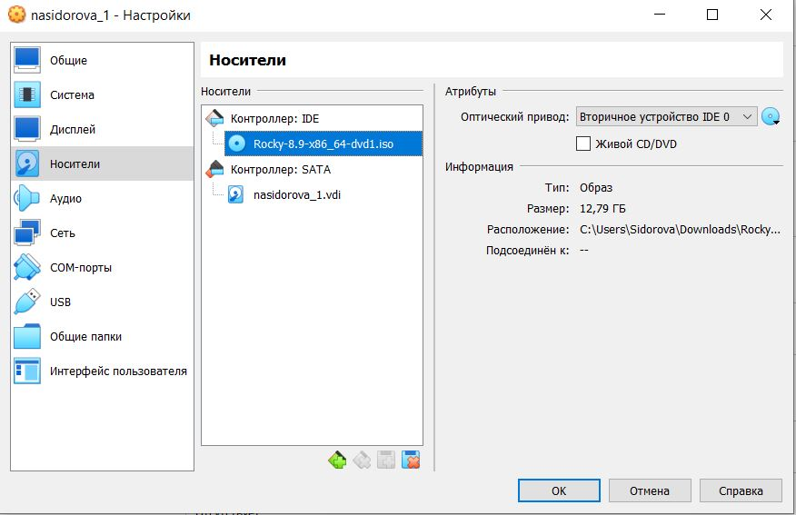
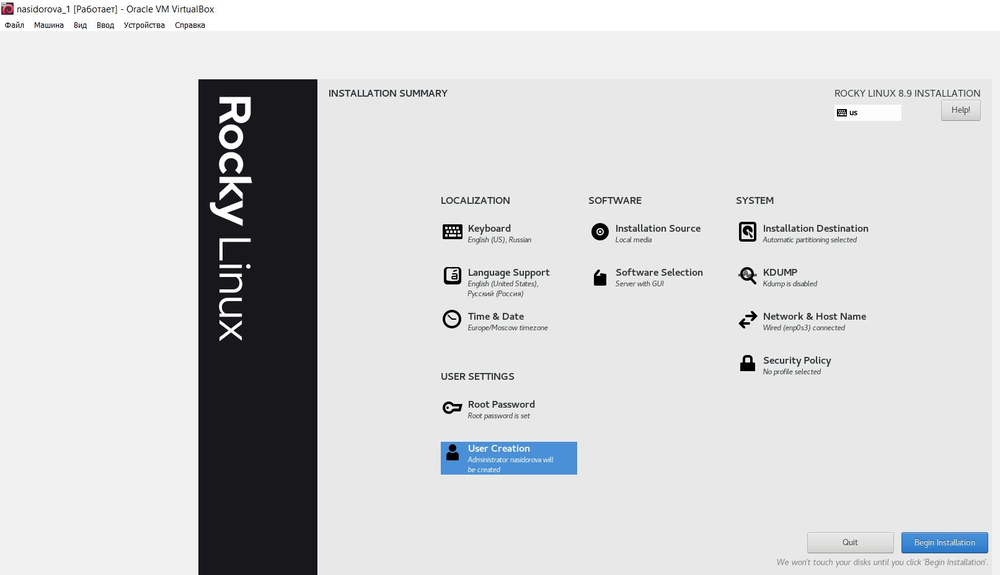
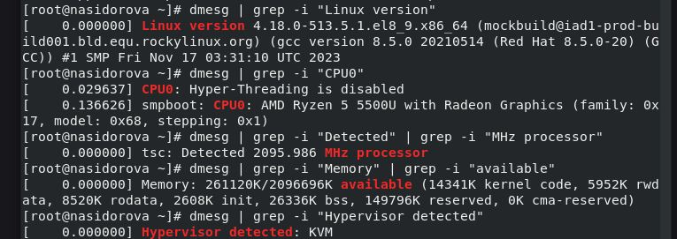
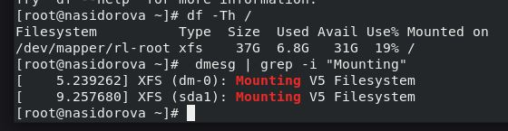

---
## Front matter
lang: ru-RU
title: Презентация к лабораторной 1
subtitle: Лабораторная работа № 1. Установка и конфигурация операционной системы на виртуальную машину
author:
  - Сидорова Н.А.
institute:
  - Российский университет дружбы народов, Москва, Россия
  - Объединённый институт ядерных исследований, Дубна, Россия
date: 17 февраля 2023

## i18n babel
babel-lang: russian
babel-otherlangs: english

## Formatting pdf
toc: false
toc-title: Содержание
slide_level: 2
aspectratio: 169
section-titles: true
theme: metropolis
header-includes:
 - \metroset{progressbar=frametitle,sectionpage=progressbar,numbering=fraction}
 - '\makeatletter'
 - '\beamer@ignorenonframefalse'
 - '\makeatother'
---

# Информация

## Цель работы 

Целью данной работы является приобретение практических навыков
установки операционной системы на виртуальную машину, настройки минимально необходимых для дальнейшей работы сервисов.

## установка машины

{#fig:001 width=70%}

## Подключение оптического диска

{#fig:004 width=70%}

## Полные настройки машины

{#fig:009 width=70%}

## Выполнение дз 

{#fig:011 width=70%}

## Выполнение дз

{#fig:012 width=70%}

:::

